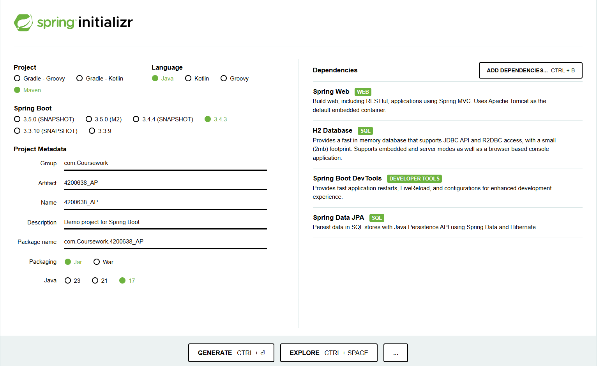
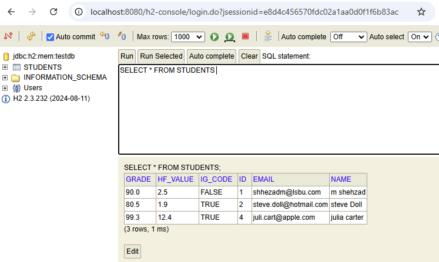
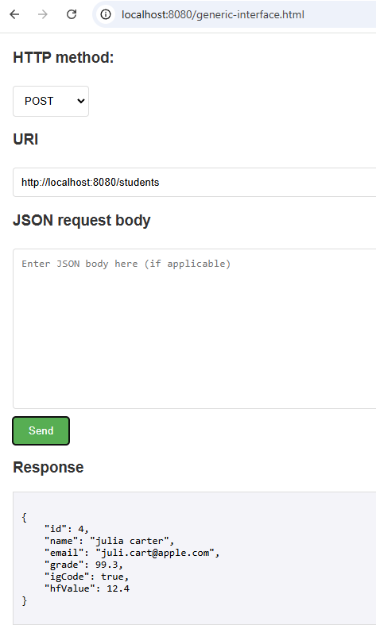
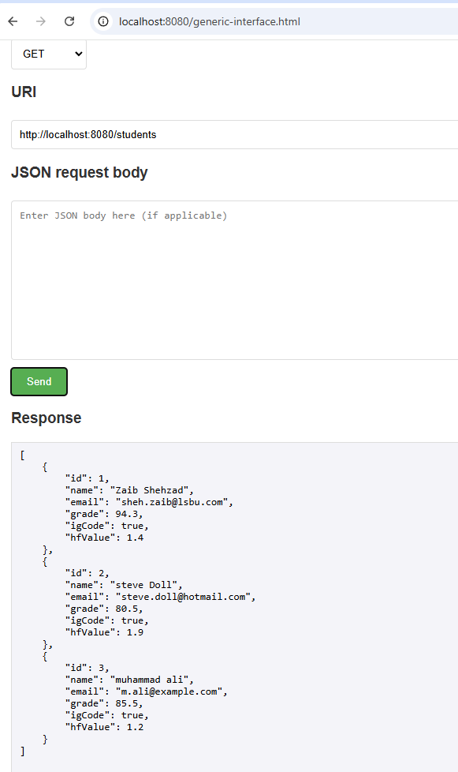
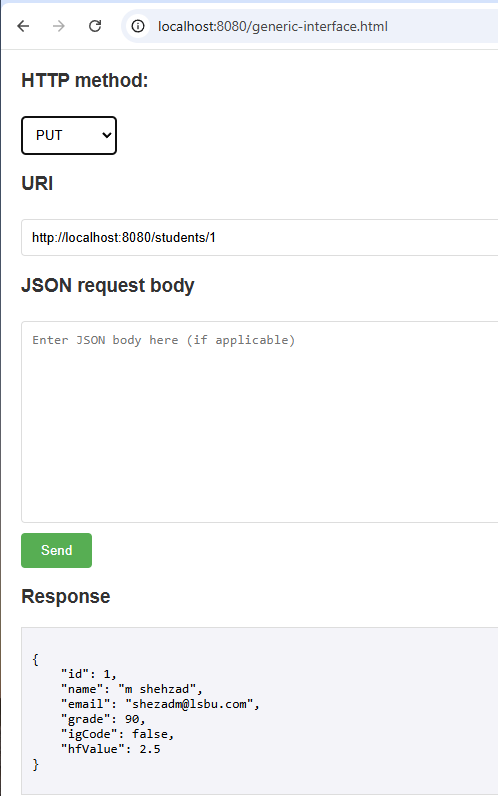
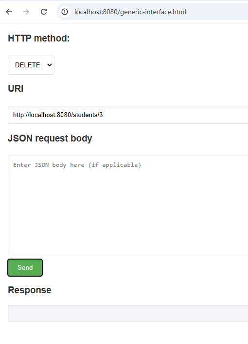

# Spring Boot Student Records REST API

This repository contains a Java Spring Boot REST API project developed as part of my Advanced Programming module.

The project demonstrates backend development using Spring Boot, RESTful API endpoints, layered architecture, Spring Data JPA, H2 database persistence, and browser-based API testing through a simple generic interface.

> This project was completed for educational purposes as part of my BSc Computer Science degree.

---

## Project Overview

The aim of this project was to build a Spring Boot application that can manage student records using standard CRUD operations.

The API allows student records to be:

- created
- retrieved
- updated
- deleted

Each student record includes fields such as:

- ID
- name
- email
- grade
- IG code
- HF value

The application uses a layered structure to separate responsibilities between the model, repository, service, and controller layers.

---

## Main Features

- Spring Boot REST API
- CRUD operations for student records
- H2 database integration
- File-based H2 persistence
- Spring Data JPA repository layer
- Service layer for business logic
- Controller layer for HTTP request handling
- Browser-based testing interface
- JSON request and response handling
- Basic exception handling for missing records
- CORS-ready frontend/backend testing approach

---

## Tech Stack

| Area | Technology |
|---|---|
| Language | Java |
| Framework | Spring Boot |
| Web/API | Spring Web |
| Data Access | Spring Data JPA |
| Database | H2 Database |
| Build Tool | Maven |
| Testing Interface | HTML generic interface |
| IDE Used | IntelliJ IDEA |
| Version Control | Git and GitHub |

---

## Repository Structure

```text
spring-boot-web-application/
├── .mvn/
├── docs/
│   └── screenshots/
├── src/
│   ├── main/
│   │   ├── java/
│   │   │   └── com/Coursework/__AP/
│   │   │       ├── Application.java
│   │   │       ├── Student.java
│   │   │       ├── StudentController.java
│   │   │       ├── StudentRepository.java
│   │   │       └── StudentService.java
│   │   └── resources/
│   │       ├── application.properties
│   │       └── static/
│   │           └── generic-interface.html
│   └── test/
├── pom.xml
├── mvnw
├── mvnw.cmd
├── .gitignore
└── README.md
```

---

## Architecture

The project follows a layered Spring Boot architecture.

```text
Browser / Generic Interface
        |
        v
StudentController
        |
        v
StudentService
        |
        v
StudentRepository
        |
        v
H2 Database
```

---

## Application Layers

### Model Layer

The `Student.java` class represents the student entity stored in the database.

It contains fields such as:

- `id`
- `name`
- `email`
- `grade`
- `igCode`
- `hfValue`

The entity uses JPA annotations to map the class to a database table and automatically generate unique IDs.

---

### Repository Layer

The `StudentRepository.java` interface extends Spring Data JPA repository functionality.

This provides built-in methods for:

- saving records
- finding records
- updating records
- deleting records

It also includes a custom finder method for filtering students by IG code.

---

### Service Layer

The `StudentService.java` class contains the main business logic for student operations.

It handles methods such as:

- `getAllStudents()`
- `getStudentById(Long id)`
- `addStudent(Student student)`
- `updateStudent(Long id, Student newStudent)`
- `deleteStudent(Long id)`
- `getStudentsByIgCode(boolean igCode)`

This layer helps keep controller logic cleaner and makes the application easier to maintain.

---

### Controller Layer

The `StudentController.java` class handles HTTP requests.

It uses Spring Boot REST annotations such as:

- `@RestController`
- `@RequestMapping`
- `@GetMapping`
- `@PostMapping`
- `@PutMapping`
- `@DeleteMapping`

The controller exposes endpoints for creating, retrieving, updating, deleting, and filtering student records.

---

## API Operations

| Method | Endpoint Example | Purpose |
|---|---|---|
| `GET` | `/students` | Retrieve all student records |
| `GET` | `/students/{id}` | Retrieve one student by ID |
| `POST` | `/students` | Add a new student record |
| `PUT` | `/students/{id}` | Update an existing student record |
| `DELETE` | `/students/{id}` | Delete a student record |
| `GET` | `/students/igCode/{igCode}` | Retrieve students by IG code status |

The API communicates using JSON request and response data.

---

## Example JSON Request

```json
{
  "name": "Example Student",
  "email": "student@example.com",
  "grade": 75.5,
  "igCode": true,
  "hfValue": 12.4
}
```

---

## H2 Database Configuration

The application uses H2 database for development and testing.

The project was configured to use file-based H2 persistence so that records could remain available after restarting the application during testing.

The H2 console can be accessed locally when the application is running.

```text
http://localhost:8080/h2-console
```

---

## Testing Approach

The project was tested using a browser-based `generic-interface.html` file instead of Postman.

The interface allowed API requests to be sent directly from the browser, making it easier to test:

- POST requests for adding students
- GET requests for retrieving students
- PUT requests for updating students
- DELETE requests for removing students
- JSON responses
- database persistence
- error handling

---

## Screenshots

Selected screenshots are stored in:

```text
docs/screenshots/
```

### Spring Initializr Setup



### H2 Database Console



### POST Request



### GET Request



### PUT Request



### DELETE Request



---

## Challenges and Fixes

| Challenge | Fix |
|---|---|
| H2 database data was disappearing after restart | Changed configuration from in-memory to file-based H2 persistence |
| Updating/deleting missing students caused unclear errors | Added clearer missing-record handling through response status handling |
| Frontend interface could not call backend API correctly during testing | Reviewed request URLs and frontend/backend request handling |
| JSON responses were not always easy to read | Improved the generic interface response display |
| Debugging startup and request errors was difficult | Used logs and step-by-step testing to identify problems |

---

## How to Run Locally

This project requires Java JDK 17 or higher.

Clone the repository:

```bash
git clone https://github.com/shehzadm-muhammad/spring-boot-web-application.git
```

Open the project folder:

```bash
cd spring-boot-web-application
```

Run on Windows PowerShell:

```powershell
.\mvnw.cmd spring-boot:run
```

Run on macOS/Linux:

```bash
./mvnw spring-boot:run
```

The application should run locally at:

```text
http://localhost:8080
```

---

## What I Learned

This project helped me understand:

- how REST APIs work
- how Spring Boot applications are structured
- how MVC/layered architecture improves organisation
- how Spring Data JPA simplifies database operations
- how H2 can be used for development and testing
- how CRUD operations work in a backend application
- how browser-based testing can be used for APIs
- how to debug common backend errors

---

## Future Improvements

Possible improvements include:

- Add Spring Security authentication
- Add a better frontend using React or Vue
- Replace H2 with PostgreSQL or MySQL
- Add Swagger/OpenAPI documentation
- Add automated tests using JUnit and Mockito
- Add Docker support
- Deploy the application to a cloud platform

---

## Academic Context

This project was completed as part of the Advanced Programming module. It is included in my portfolio to demonstrate Java backend development, Spring Boot, REST API design, CRUD operations, and database integration.

---

## Author

**Muhammad Shahzaib Shehzad**  
BSc (Hons) Computer Science  
London South Bank University
